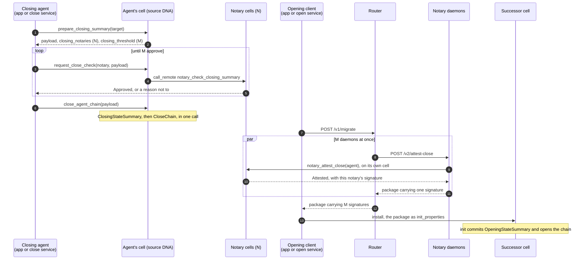

# Notary attestation after the close

How the router, the notary daemon and the headless migrator carry an agent from a closed chain to its successor when notaries attest a chain only after it has closed.

## Scope

- **Covered:** the path from a closing agent to an opened successor chain: the pre-close check, the close, the attestations, the combined package and the open.
- **Not covered:** `/v1/update-check`, `/v1/migration-options`, the registry's chain rules other than `closing_threshold`, joining and membrane proofs, the key carry, install ordering and the teardown latch.
- **Wire:** `rave_engine`'s `migration::v0_2` only. No component serves or reads a `v0_1` close.

## The flow

- Before the close, notaries only check the payload. The close carries no signatures.
- After the close, each notary reads the closed chain on its own conductor and signs `CloseAttestation { payload, close_action }`. Attesting commits nothing.
- The open needs M of those signatures over the same attestation.

## M: how many attestations are enough

- **The DNA decides M.** The successor's `gd.migration.opening_predecessors` entry for the source DNA holds the notaries and threshold its open validator enforces. That entry mirrors the source's `closing_notaries` and `closing_threshold`.
- **The validator's rule:** at least M signatures, each from a distinct listed notary, none from the migrating agent, all over the same `CloseAttestation`. One signature that fails any of these fails the whole open.
- **The router reads M from the registry.** It never reads a chain, so each source entry mirrors M as `closing_threshold`, written by the same release tooling that writes `upgrade_targets`. A registry M below the successor's threshold fails opens, and one above it asks for more attestations than an open needs. Neither forges an open.
- **The close service reads M live**, from `prepare_closing_summary`, for the pre-close check.

## Notary daemon

Each request is one zome call on the daemon's own alliance cell, signed through lair, so the daemon writes nothing to the notary's chain.

### `POST /v2/attest-close`

- Auth: the bearer token (`401 auth_failed`), and Cloudflare Access in front of the tunnel.
- Body: `{ "agent_pubkey": "<AgentPubKeyB64>" }`. An unparseable body or key is `400 bad_request`.
- It calls `transactor::notary_attest_close(agent_pubkey)` and maps the answer:

| `AttestCloseResponse` | HTTP | Body |
| --- | --- | --- |
| `Attested` | 200 | `MigrationInitRequest` with exactly this notary's signature |
| `Warranted(warrants)` | 422 | `warranted`, `details: { "warrants": [...] }` |
| `NoCloseFound` | 404 | `no_close_found` |
| `UnableToVerify` | 503 | `unable_to_verify` |
| `NotAClosingNotary` | 500 | `internal`, the message saying this node is not a closing notary on its DNA |
| the zome call fails | 500 | `internal` |

- The 200 body is the `serde_json` encoding of `rave_engine`'s `MigrationInitRequest`, byte for byte: the JSON form that crate freezes for this wire.
- The daemon combines nothing, caches nothing and retries nothing.
- There is no `/v1/fetch-close`.

### `GET /healthz`

Healthy only when the conductor answers `ping` and the cell answers `whoami`. It reports `api_versions: ["v2"]` and `protocol_versions: ["v0_2"]`.

### What the notary key signs

- It signs an attestation only inside `notary_attest_close`, and only for an unwarranted agent whose chain is closed with a single `ClosingStateSummary` directly before its `CloseChain`.
- An attestation serves only that agent: the open validator binds the payload's agent to the opening author. So anyone who can reach the router may ask for attestations of any closed chain, and gains nothing by it.

## Router

### Registry

- Every notary's `api` is `v2`. The router refuses to load any other.
- An entry lists each notary once: two `url`s that differ only in host case, a default port or trailing slashes are one notary. The router refuses to load a registry that breaks this.
- Every entry with `upgrade_targets` carries `closing_threshold`, an integer from 1 to the entry's number of `notaries`. The router refuses to load a registry that breaks this.

### `POST /v1/migrate`

The request is `{ to_dna_hash, agent_pubkey, from_dna_hash? }` and a success body is `{ payload, notary_signatures, close_action }`. The candidate sources are `from_dna_hash` when given, otherwise every entry whose `upgrade_targets` include `to_dna_hash`, tried in turn. For each:

1. M is the source's `closing_threshold`, and its daemons are ordered at random for this request.
2. The first M daemons are asked at once. Every answer that does not count starts the next daemon in the order, until none are left.
3. An answer is well formed when it is a 200 whose body has:
   - a `payload` whose `source_dna_hash` is this source and whose `agent_pubkey` is `agent_pubkey`;
   - exactly one signature, whose `notary` is an agent key and whose `signature` is 64 bytes;
   - a `close_action` that is an action hash.

   It is bound to the target its `payload.target_dna_hash` names. A daemon that serves another agent's close fails here, so a client never installs a package it cannot open.
4. The first well-formed answer bound to `to_dna_hash` fixes the package's `payload` and `close_action`. A well-formed answer, that first one included, counts when its `payload` and `close_action` are byte-identical to the fixed ones, and its signer has not counted already and is not `agent_pubkey`.
5. The moment M answers count, the response is the fixed `payload` and `close_action` with those M signatures. Answers still in flight are ignored.
6. Three answers end the request or the source early:
   - `warranted` from any daemon: `422 warranted` at once, with that daemon's details.
   - `bad_request` from any daemon: `400 bad_request` at once.
   - a well-formed answer bound to another target, before the package is fixed: the agent's close on this source binds elsewhere, so the next source is tried.
7. Anything else does not count: `no_close_found`, `unable_to_verify`, `internal`, `auth_failed`, `rate_limited`, a timeout, a transport failure, a 200 that is not well formed, a package that differs from the fixed one, a repeated signer, the agent's own signature.

An error answer is read by its `{ "error": { "code" } }` envelope. A code outside the daemon's table is `internal`. An answer with no envelope usually comes from in front of the daemon, the tunnel or Cloudflare Access, and is read by its status:

| Status | Read as |
| --- | --- |
| 401, 403 | `auth_failed` |
| 429 | `rate_limited` |
| 5xx | a daemon that could not be reached |
| any other | `internal` |

The router logs every answer that does not count, with its daemon and the reason.

When no source reaches M, the response is the first row that applies:

| Condition | Response |
| --- | --- |
| a daemon fault: `internal`, a 200 that is not well formed, or a package that differs from the fixed one | `500 internal` |
| a daemon said `unable_to_verify`, or some answers counted but fewer than M | `503 unable_to_verify` |
| a daemon said `auth_failed` | `502 auth_failed` |
| a daemon said `rate_limited` | `503 rate_limited` |
| a daemon timed out or could not be reached | `503 all_orgs_unhealthy` |
| every daemon said `no_close_found`, or every close binds elsewhere | `404 no_close_found` |

No code reaches a client that it does not already know.

### The package goes out as the daemons served it

- `payload` and `close_action` in the response are the exact JSON text of the answer that fixed them, and each signature is its daemon's JSON.
- Notaries sign the msgpack bytes of `CloseAttestation`, payload included, and the payload's `carryover` is an ordered JSON map. A JavaScript parse and stringify moves integer-like keys to the front in numeric order (`{"10":1,"9":2}` becomes `{"9":2,"10":1}`), and a client that encodes that order fails the signature check at open.

### Timeouts

| Hop | Budget |
| --- | --- |
| router to daemon | 10 s per call. An answer later than that does not count. |
| daemon to conductor | `HAM_REQUEST_TIMEOUT_SECS`, 30 s by default |
| one source, worst case | with N daemons, one slot makes at most `N - M + 1` calls in a row, so `(N - M + 1) × 10 s` |
| headless migrator to router | 30 s. A client timeout is transient and the migrator asks again. |
| headless migrator's close check | `MIGRATION_AGENT_SIGN_TIMEOUT_SECS`, 120 s by default. The migrator's conductor connection times a request out at the larger of that and `HAM_REQUEST_TIMEOUT_SECS`, so it never cuts a check short. |

### `GET /healthz`

Reports `protocol_versions: ["v0_2"]`.

## Headless migrator

### Close service, on the old server

1. **Probe** with `get_migration_close_state`:
   - it returns a close: the chain is closed. Exit 0, writing nothing.
   - `MIG_NO_CLOSING_SUMMARY`: the chain is open. Continue.
   - `MIG_NO_CLOSE_CHAIN_ACTION`, a summary with no close: hard stop. The DNA refuses a second closing summary with `MIG_SECOND_CLOSING_SUMMARY`, so closing again can never succeed. The shipped DNA commits the summary and the close in one call, so a chain reaches this state only by other means.
   - a response that does not decode: hard stop.
   - anything else: back off and probe again.
2. **Fees owed** are dropped with `drop_off_fees` before anything is prepared.
3. **Prepare:** `prepare_closing_summary(to_dna)` returns the payload, N and M.
4. **Check:** ask notaries drawn at random from N, through `request_close_check`, until M answer `Approved`.

   | `CloseCheckResponse` | Action |
   | --- | --- |
   | `Approved` | counts |
   | `StateMismatch`, `TargetNotApproved` | the same notary again after a backoff, up to `MIGRATION_AGENT_STATE_MISMATCH_RETRIES` times, then a substitute |
   | `UnableToVerify`, `NotAClosingNotary`, a timeout, a failed call | a substitute |
   | `Warranted`, or a response that does not decode | hard stop |

   When too few notaries remain to reach M, back off and probe again. Nothing was committed, so the next pass prepares afresh.

   When M is 0, or N holds fewer distinct notaries than M, no check can pass: hard stop, before any notary is asked, naming which.
5. **Close:** `close_agent_chain(payload)`. `MIG_CLOSE_TARGET_NOT_UPGRADE_TARGET` is a hard stop. Any other error backs off and probes again.

- Approvals gate the close and are not carried in it.
- The policy variables keep the names the release tooling renders: `MIGRATION_AGENT_SIGN_TIMEOUT_SECS` (each check request, 120 s by default), `MIGRATION_AGENT_STATE_MISMATCH_RETRIES`, `MIGRATION_AGENT_SIGN_RETRY_INITIAL_SECS` and `MIGRATION_AGENT_SIGN_RETRY_MAX_SECS`.

### Open service, verify and status

- The open service fetches the package from the router, installs with it as `init_properties`, drives `init` and verifies.
- `no_close_found` and `unable_to_verify` from the router keep the open service waiting. Right after a close, notaries may not see it yet.
- Every fetch, including the ones `verify` and `status` make, has notaries attest again. That writes nothing.

### State file

- During the check, `step` is `collecting_approvals`, and `approvals_collected` and `approvals_threshold` count approvals.
- A chain found already closed leaves both unset: its close carries no signatures to count.

## Versions

- The router's public API is `v1`.
- The router speaks `v2` to daemons.
- Both Rust crates pin `rave_engine` to exactly `0.12.0`, the published release that carries `migration::v0_2`.
